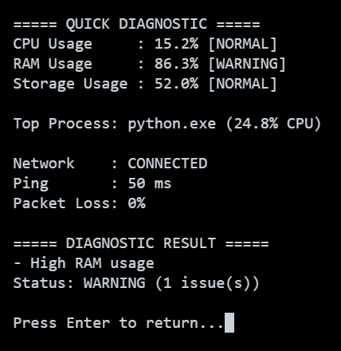
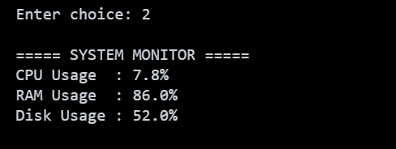
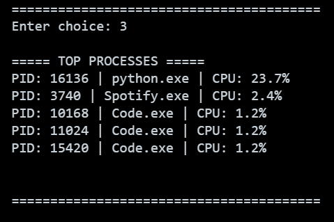
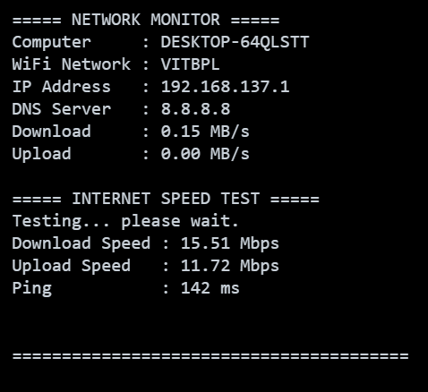
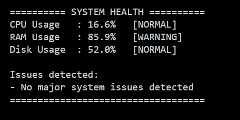
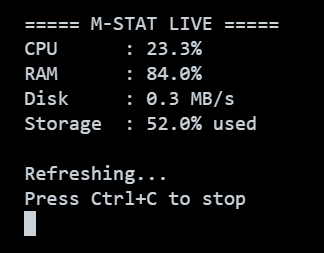

# 🖥️ M-STAT V1.0

### 🔍 System & Network Monitoring and Diagnostic Tool

M-STAT is a Python-based terminal application designed to help users quickly understand what is happening on their computer and network.

Instead of switching between multiple Windows utilities, M-STAT brings several useful monitoring and diagnostic features together in one simple terminal interface.

---

## 🎯 Problem Statement

When a computer becomes slow or the internet connection becomes unstable, users often need to check multiple tools to identify the cause.

M-STAT provides these checks through one lightweight terminal-based application.

---

## 🚀 Features

### 🩺 Quick Diagnostic

Runs several checks together:

- 🧠 CPU usage
- 💾 RAM usage
- 💿 Storage usage
- ⚙️ Top CPU-consuming process
- 🌐 Network connectivity
- 📡 Ping latency
- 📦 Packet loss
- 📊 Overall diagnostic status

### 🖥️ System Monitor

Displays:

- CPU usage
- RAM usage
- Storage usage

### ⚙️ Process Monitor

Shows the top CPU-consuming processes along with:

- Process ID (PID)
- Process name
- CPU usage

### 🌐 Network Monitor

Displays:

- 💻 Computer name
- 📶 Connected Wi-Fi network
- 🌍 IP address
- 🔐 DNS server
- 📥 Current download traffic
- 📤 Current upload traffic
- 🚀 Internet download speed
- 🚀 Internet upload speed

### ❤️ Health Analyzer

Classifies system resource usage into:

- 🟢 NORMAL
- 🟡 WARNING
- 🔴 HIGH

### 📈 Live Monitor

Continuously displays changing system information including:

- CPU usage
- RAM usage
- Disk activity
- Storage usage

Press `Ctrl + C` to stop the live monitor.

---

# 📸 Screenshots

## 🏠 Main Menu


## 🩺 Quick Diagnostic



## 🖥️ System Monitor



## ⚙️ Process Monitor



## 🌐 Network Monitor



## ❤️ Health Analyzer



## 📈 Live Monitor



---

# 🛠️ Technologies Used

- 🐍 Python
- 📊 psutil
- 🚀 speedtest-cli
- 🪟 Windows networking utilities

---

# 📁 Project Structure

```text
M-STAT-V1.0/
|
|-- main.py
|-- diagnostics.py
|-- health_analyzer.py
|-- live_monitor.py
|-- network_monitor.py
|-- process_monitor.py
|-- system_monitor.py
|
|-- README.md
|-- statement.md
|-- requirements.txt
|-- run.bat
|
`-- screenshots/
    |-- Main menu.png
    |-- M-STAT_Live.png
    |-- network_monitor.png
    |-- process_monitor.png
    |-- quick_diagnostic.png
    |-- system_health.png
    `-- system_monitor.png
